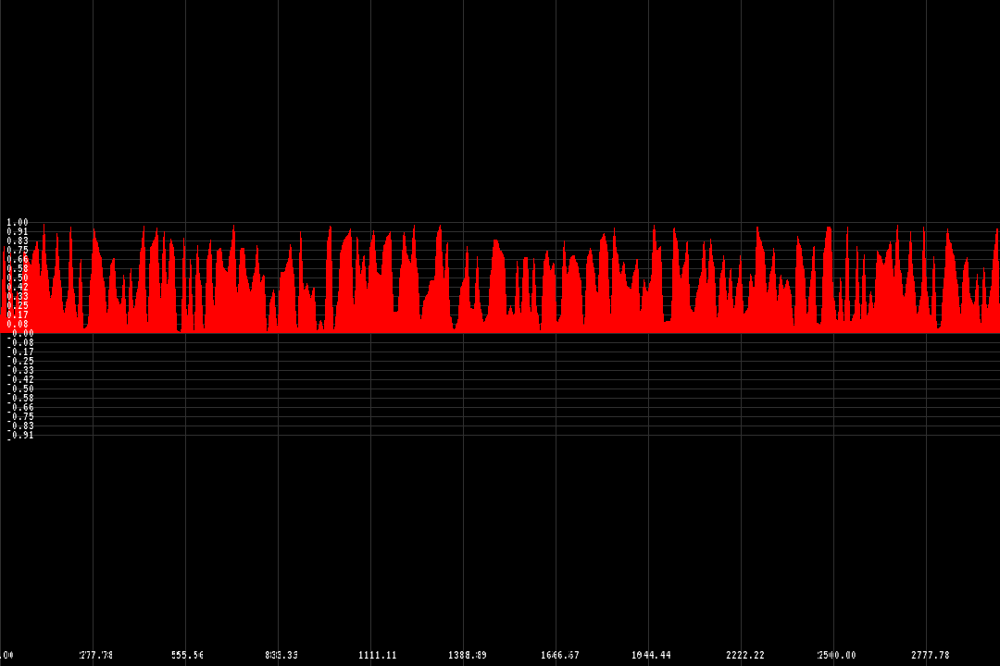

# plot
> C++ plot library

<div style="text-align: center;" align="center">
    
</div>

## Building it
> First make sure you have `cmake` installed,
> then run the following commands:
``` bash
./pull_deps.sh
mkdir build && cd build && cmake ../ && make
```
> This will generate the following targets:
* libplot.a
* plot_e

## Using it
> Here's a minimal example:
``` C++
#include <Plot.hpp>
#include <cmath>

#define DATA_LEN 400

int main(int argc, char* argv[])
{

  // Generate some data
  float data[DATA_LEN];
  for (int i = 0; i < DATA_LEN; i++) {
    data[i] = cos((float)i / 24.0f);
  }

  Plot* plot = new Plot(640, 480);
  plot->set_data(data, DATA_LEN);
  plot->compute();
  plot->save("plot.bmp"); // can be saved as .bmp if you want
  plot->show(); // opens up a real-time window of your plot

  // Update the plot information while the plot window is showing.
  // The plot will be updated in real-time.
  float k = 0;
  while (1) {
    for (int i = 0; i < DATA_LEN; i++) {
      data[i] = cos((float)(k + i) / 24.0f);
    }

    plot->set_data(data, DATA_LEN);
    plot->compute();

    k += 0.003f;
  }

  return 0;
}
```
